# Robot Flautista

Este repositorio contiene el código necesario para controlar el robot flautista.
En su ejecución el programa despliega la ventana principal, donde es posible componer las instrucciones que se le quiere dar al robot, manipularlo en tiempo real, ajustar las configuraciones y visualizar la evolución temporal de las variables de interés.

### Requerimientos
Si es primera vez que lo corre en su computador es posible que tenga que instalar algunas librerias. Algunas de estas pueden ser:
- cpppo
- numpy
- matplotlib
- pyqt5

De todas formas, si no tiene alguna librería necesaria, la ejecución terminará con un Import Error informando qué debe hacer para solucionarlo. Luego de algunas ejecuciones incorrectas podrá haber instalado todas las librerías necesarias.

También es posible que deba borrar el contenido del archivo de texto recent_files.txt que se encuentra en la carpeta view_control.

Si al ejecutar el código alguno de los dispositivos no se encuentra conectado es posible dar aviso al programa cambiando el valor de la variable ``connected`` en la inicialización del dispositivo (en main.py).

### Estructura del codigo
El script principal a ejecutar es main.py, en este se incializan los dispositivos permitiendo ajustar parámetros de sus configuraciones y el estado de su conexión.

#### Examples
En la carpeta examples se tiene algunos ejemplos de partituras básicas que pueden cargarse al programa.

#### Views
En la carpeta views se tiene los archivos necesarios para cargar las estructuras de las ditintas ventanas que componen la interfaz. Cada uno de los archivos con extensión .ui fue creado en Qt Designer y los .py fueron generados con el comando ``pyuic5 -o <output_file_name>.py <input_file_name>.ui`` en la terminal. Estos últimos no debieran ser inerferidos porque su contenido es borrado cada vez que se ejecuta este comando. Sobre los cada uno de los archivos .ui:

- **amci_driver_configuration**: ventana para configurar los parámetros de alguno de los driver AMCI
- **amci_driver**: ventana con algunas de las funciones principales para manipular, controlar y dar instrucciones a uno de los drivers AMCI
- **assembled_move_step1**: ventana de diálogo para partir programando un movimiento tipo assembly en uno de los drivers AMCI
- **assembled_moce_step2**: ventana de diálogo para indicar las posiciones y perfiles de velocidad para un movimiento tipo assembly en uno de los drivers AMCI
- **calibrate_angle_autohome_window**: ventana de diálogo para el homing del eje alpha
- **calibrate_flute_menu**: ventana de diálogo para indicar la posición de la flauta
- **dialog_control**: ventana de diálogo para ajustar los parámetros del lazo de control del flujo
- **finger_window**: ventana de diálogo para agregar una acción para los dedos
- **main_window**: ventana principal
- **move_edit_window**: ventana de diálogo para agregar una acción de la frase musical (posición más flujo)
- **start_edit_window**: ventana de diálogo para agregar una acción de posicionamiento inicial
- **plot_window**: ventana que aloja un gráfico para visualizar la evolución temporal de una o varias variables 
   
Si se quiere hacer un cambio en alguno de estos archivos es importantes que, despues de guardarlos, se ejecute el comando ``pyuic5 -o <output_file_name>.py <input_file_name>.ui`` en la misma carpeta, de forma que el cambio sea efectivo.

#### View Control
En la carpeta view_control se tienen algunos scripts de python que conectan elementos de algunas de las ventanas con funciones a ejecutar o que agregan elementos a algunas de las ventanas. 
- **action_display**: contiene el código relacionado al widget que se agrega en la ventan principal para simbolizar una acción (de posicionamiento inicial, de la frase musical o de los dedos).
- **amci_control**: permite manipular uno de los drivers AMCI con varias de las funciones o instrucciones más comunes.
- **collapsible_widgets**: contiene el código para agregar una widget collapsible, es decir que puede 'minimizarse'. En el programa se usa para esconder los controles de posición y visualizar simplemente el espacio donde se encuentra la partitura.
- **forms**: contiene el codigo que controla las distintas ventanas en las que se ingresa información.
- **LedIndicatorWidget**: código descargado de [link](https://github.com/nlamprian/pyqt5-led-indicator-widget/blob/master/LedIndicatorWidget.py) que permite agregar widgets tipo Led Indicator, para visualizar mejor las señales recibidas de cada uno de los drivers AMCI
- **main_window**: gestiona las instrucciones ingresadas desde la ventana principal.
- **plot_pyqt**: permite plotear en ventanas de diálogo la ruta de un cambio de estado, ya sea su posición o su cambio de flujo.
- **plot_window**: controla la ventana en la que se plotean en tiempo real las distintas variables.

#### Utils
En esta carpeta se tienen algunos scripts con herramientas para 
- **cinematica**: contiene algunas funciones para convertir de las variables del sistema a las variables controlables.
- **driver_amci**: encargado de toda la comunicación con los drivers AMCI.
- **microphone**: la clase que registra el sonido escuchado y lo analiza. 
- **player**: contiene clases que coordinan toda la interacción con los distitos dispositivos.
- **sensores_alicat**: encargado de la comunicación con los dispositivos Alicat
- **terminal_serial**: terminal por el que se pueden mandar instrucciones de forma serial. Actualmente en deshuso.

### Instrucciones de uso

Al ejecutar el programa lo primero que ocurre es la rutina de homing. Los ejes X y Z se llevan a cabo de forma autonoma, en cambio alpha (al no disponer de un home switch) se hace de forma manual. Es aquí cuando aparece una ventana de diálogo que pide ingresar valores en ángulos para orientar la boca de forma horizontal. Cuando la boca ya esta en la posición correcta, se selecciona el botón de Ok y se inicia la ventana principal.

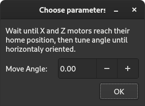

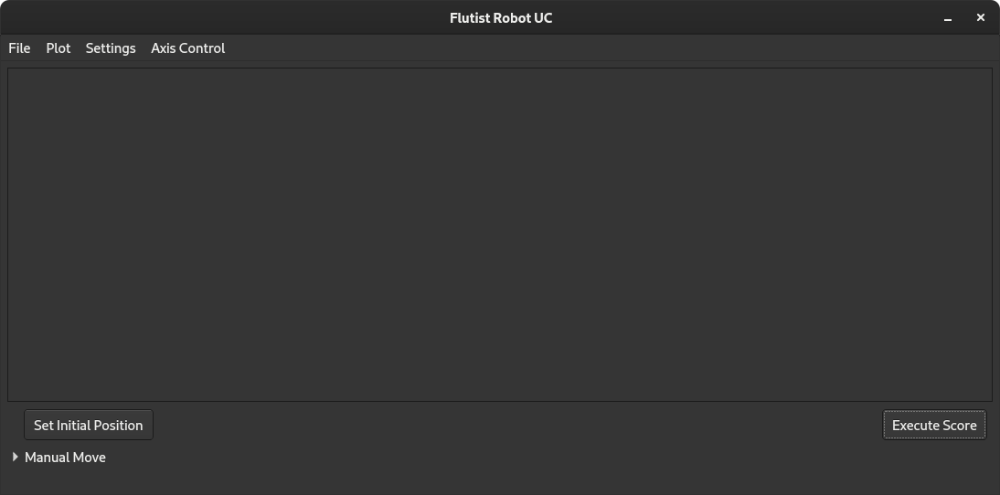

En esta ventana principal se ofrece un menú en la parte superior que permite algunas acciones.

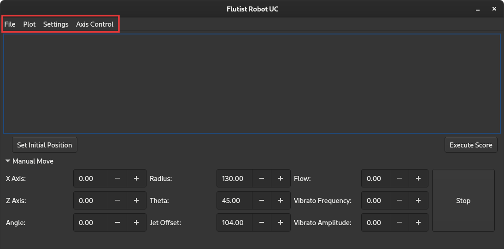

En File se puede abrir un archivo que haya sido guardado, empezar una partitura nueva o guardar la que está siendo trabajada.

En Plot se puede desplegar el gráfico de la evolución temporal de alguna variable de interés.

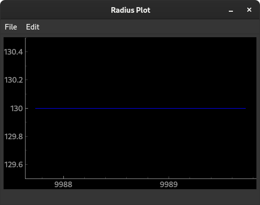

En estos gráficos es posible agregar varias curvas para comparar parámetros en una misma ventana. También se pueden abrir varias ventanas a la vez.

En Settings es posible ajustar parámetros como la posición de la flauta, los datos del loop de control del flujo, reestablecer la conexión de algún componente que la haya perdido o llevar a cabo la rutina de autohome.

En Axis Control es posible abrir una herramienta visual para controlar o configurar alguno de los drivers que manejan los motores. 

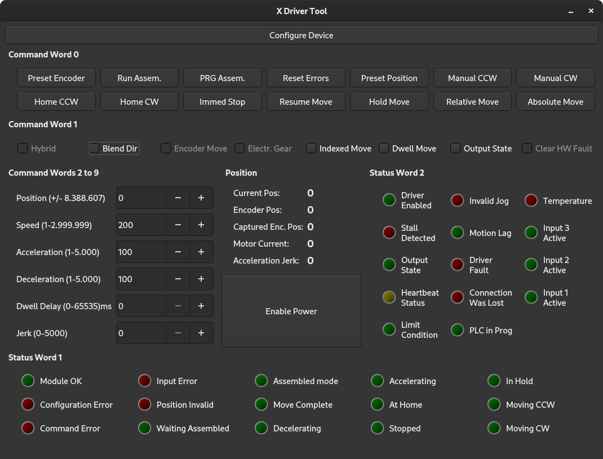

En esta interfaz se puede ver el estado de distintos indicadores del driver (en los distintos leds), el estado de la posición, de la corriente enviada, etc. También es posible enviar instrucciones de movimiento como movimiento manual (CW o CCW), movimiento relativo, absoluto, de ensamble (donde se puede programar un perfil de velocidades de hasta 16 segmentos) o llevar a cabo una rutina de homing (CW o CCW). También se puede detener una acción en movimiento, o resetear los errores, o definir la posición actual, desactivar la corriente al motor, etc. Por último es posible desplegar una ventana donde se pueden ajustar todos los parámetros de la configuración del dispositivo.

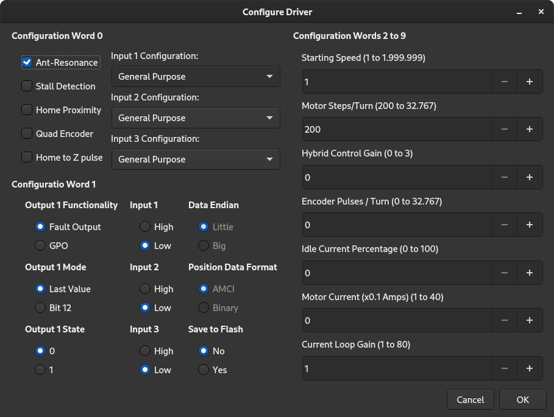

En la ventana principal también es posible mover manualmente el estado del robot con los controles de la parte inferior de la ventana. Acá se puede determinar una posición en coordenadas naturales del sistema (radio, theta y offset) o las manipulables por los motores (x, z y alpha). También es posible manipular el flujo y su vibrato.

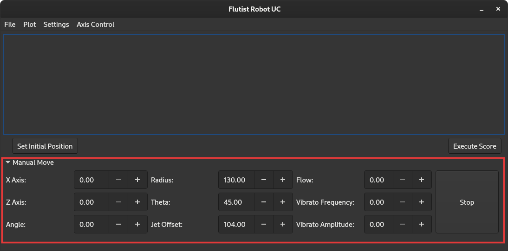

En la parte central de la ventana principal es donde se irá completando la partitura. Para esto se deben ir agregando acciones. La primera acción que se debe agregar es la de movimiento hacia una posición inicial. Esta acción se agrega pulsando el boton Set Initial Position. Al pulsarlo se desplegará un formulario pidiendo que se indique la posición en la que se quiere empezar. Esta acción es de tiempo variable, porque depende de la posición en la que se encuentre el robot antes de empezar la ejecución de una partitura. 

Cuando se hubo agregado una acción de posicionamiento inicial, se puede empezar a agregar las acciones de la frase musical (indicaciones para la posición espacial y el flujo hacia la flauta) y las acciones para el accionar de los dedos (las notas que se quieren tocar). 

Una partitura con algunas opciones se verá como la siguiente captura de pantalla:
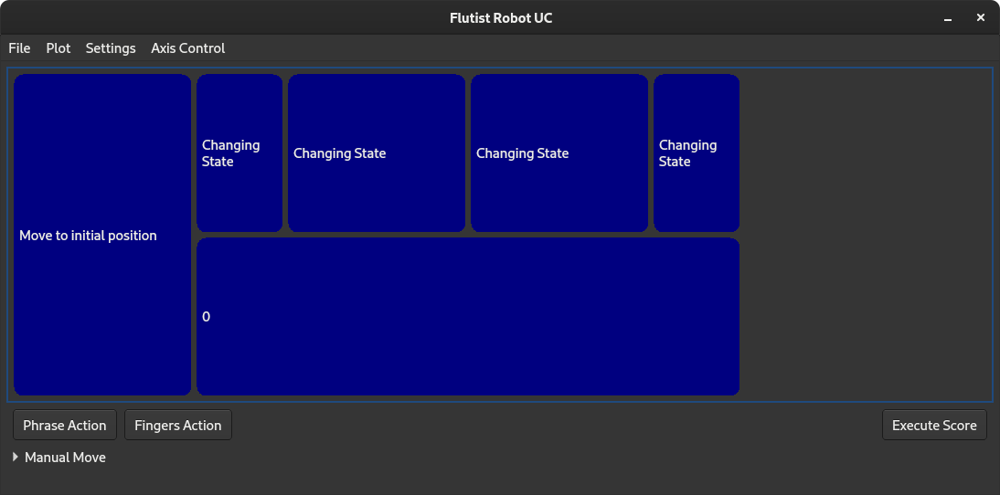

Donde a la izquierda se encuentra la acción de posicionamiento inicial:
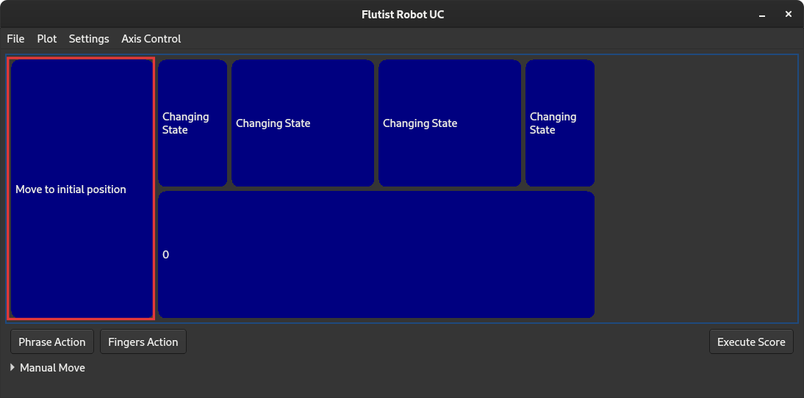

A la derecha arriba las acciones de la frase musical:
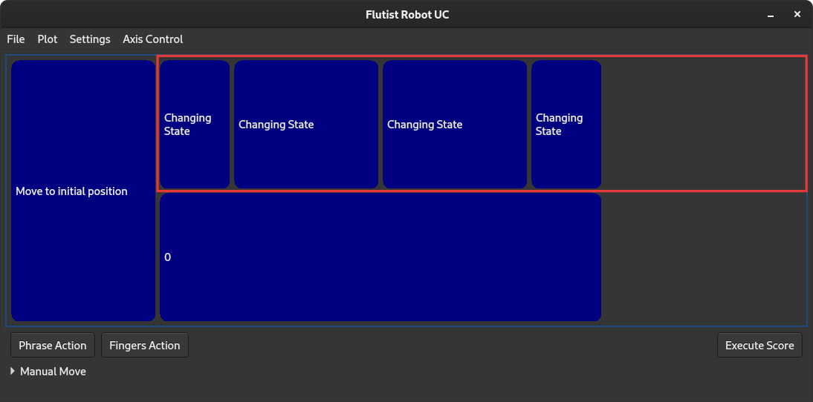

Y a la derecha abajo las acciones de los dedos:
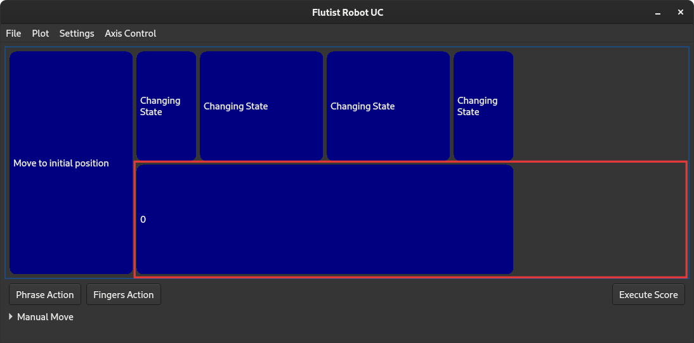

Finalmente se puede ejecutar la partitura con el botón de Execute Score. Al hacer esto se bloquean las opciones de editar la partitura o mover al robot de forma manual hasta que la partitura termine de ser ejecutada o que se detenga su ejecución.